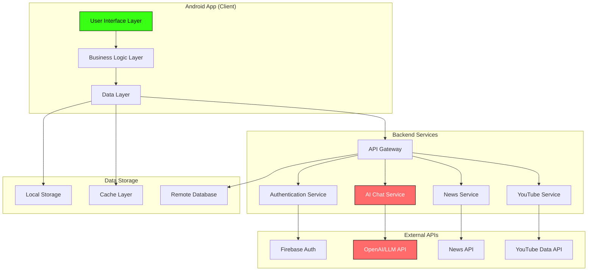
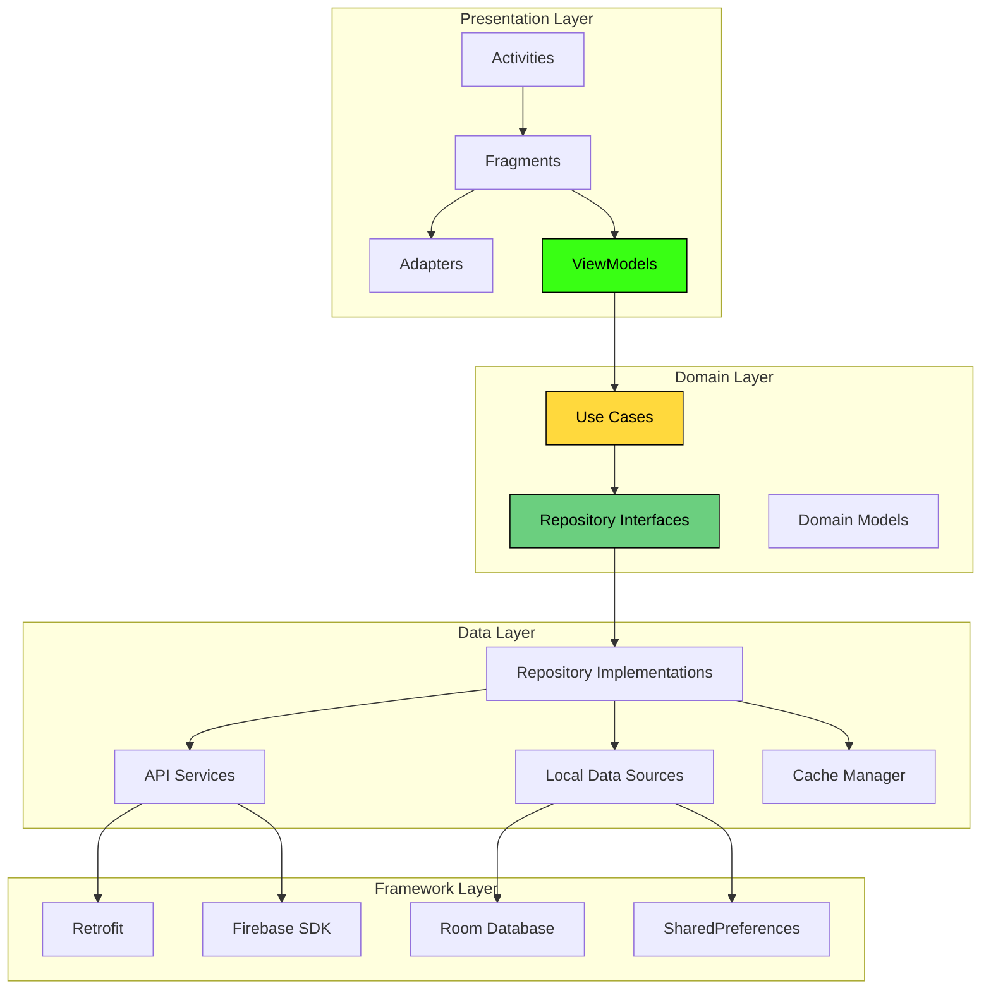
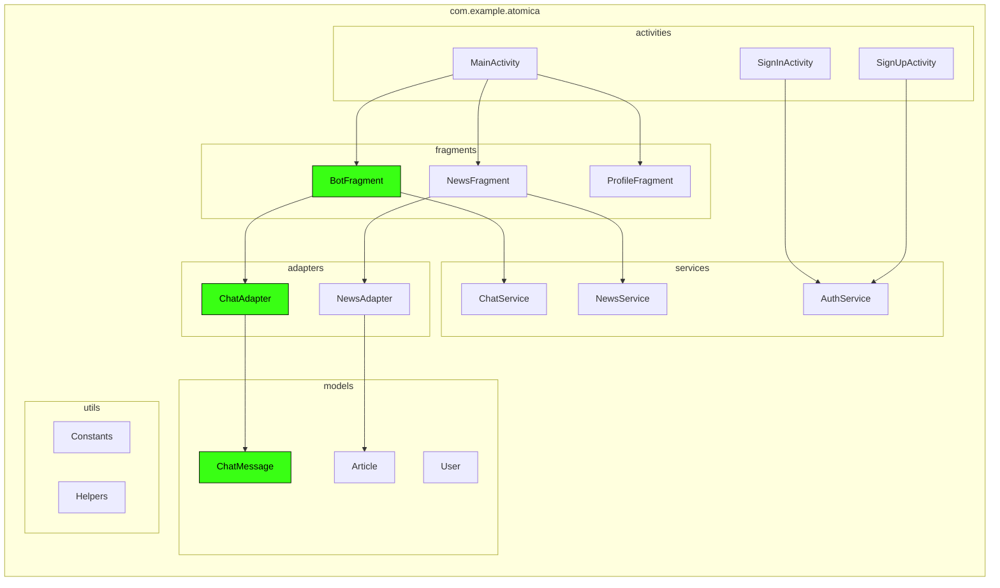
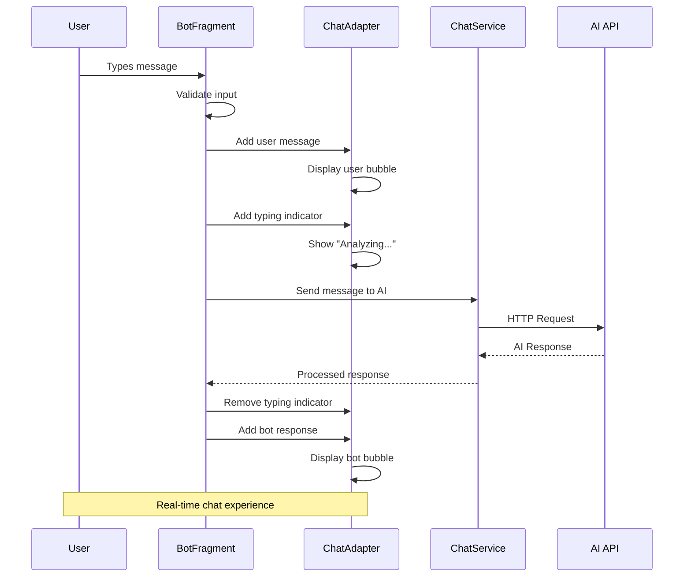
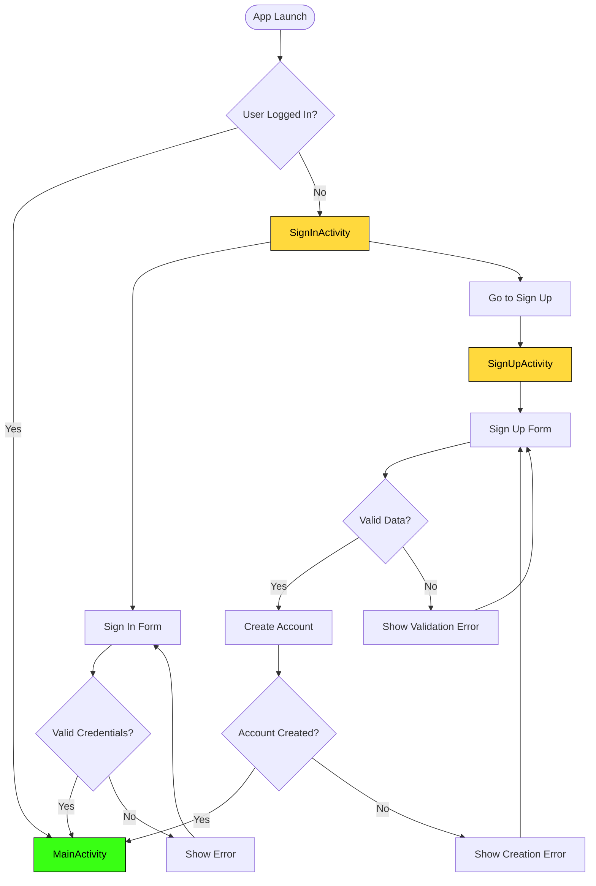
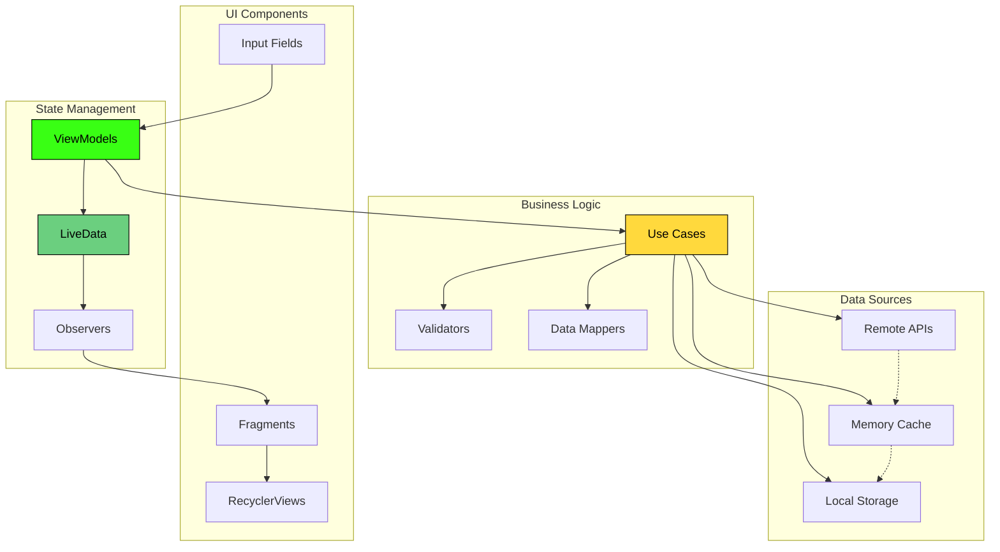
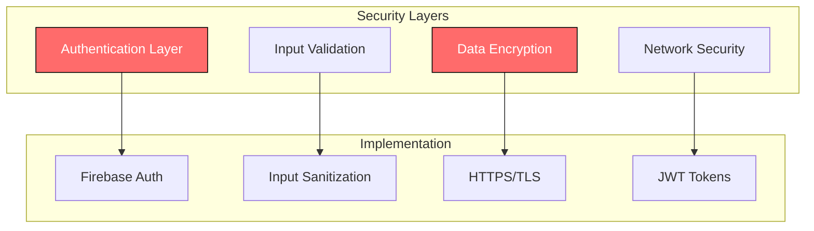

# ATOMICA - Android App Architecture

## Overview
ATOMICA is a chemistry research assistant Android application that provides AI-powered chat functionality, trending content discovery, and user authentication. The app follows modern Android architecture patterns with a focus on modularity and maintainability.

## High-Level System Architecture

## Android App Architecture (MVVM Pattern)

## App Module Structure

## Chat System Architecture

## Authentication Flow

## Data Flow Architecture

## Technology Stack

### Frontend (Android)
- **Language**: Java
- **UI Framework**: Android Views + Material Design 3
- **Architecture**: MVVM (Model-View-ViewModel)
- **Navigation**: Fragment-based navigation
- **Networking**: Retrofit + OkHttp
- **Image Loading**: Glide/Picasso
- **Authentication**: Firebase Auth

### Backend Services
- **API Gateway**: RESTful APIs
- **Authentication**: Firebase Authentication
- **AI Service**: OpenAI/Google AI Platform
- **Content APIs**: News API, YouTube Data API
- **Database**: PostgreSQL/Firebase Firestore
- **Caching**: Redis/In-memory cache

### Key Design Patterns
- **MVVM**: Separation of concerns
- **Repository Pattern**: Data abstraction
- **Observer Pattern**: Reactive UI updates
- **Adapter Pattern**: RecyclerView implementations
- **Singleton Pattern**: Service instances

## Security Considerations

## Performance Optimization

- **Lazy Loading**: Load content on demand
- **Image Caching**: Efficient image management
- **Memory Management**: Proper lifecycle handling
- **Network Optimization**: Request batching and caching
- **UI Optimization**: ViewHolder pattern, smooth animations

## Future Scalability

- **Modular Architecture**: Easy feature addition
- **Plugin System**: Extensible functionality
- **Microservices**: Independent service scaling
- **CDN Integration**: Global content delivery
- **Offline Support**: Local data synchronization